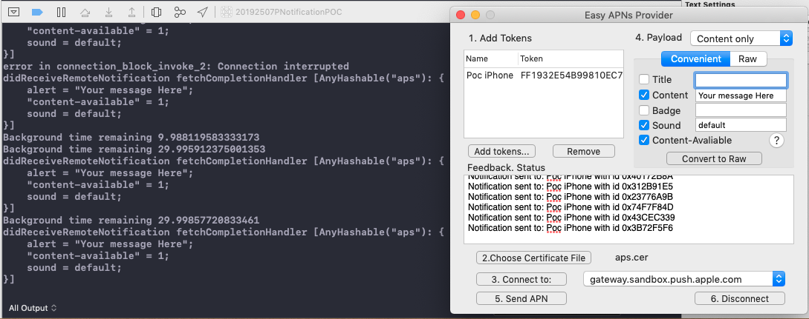
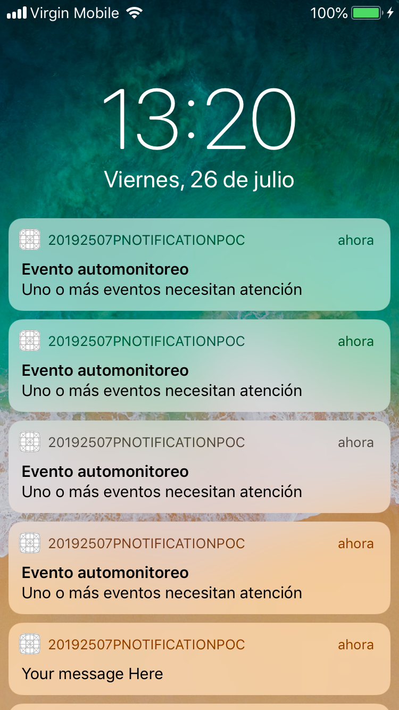
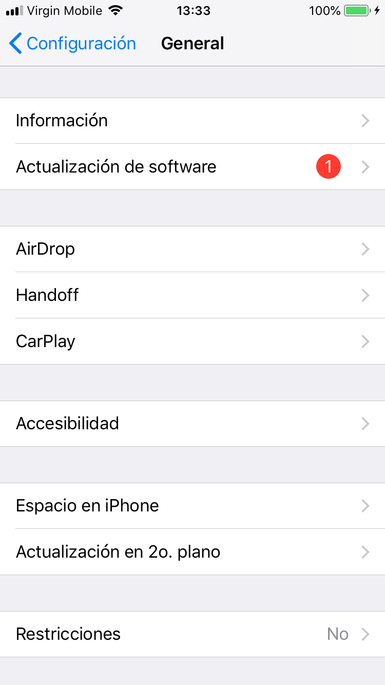
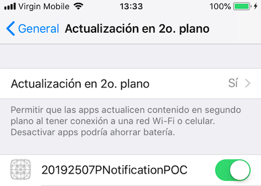
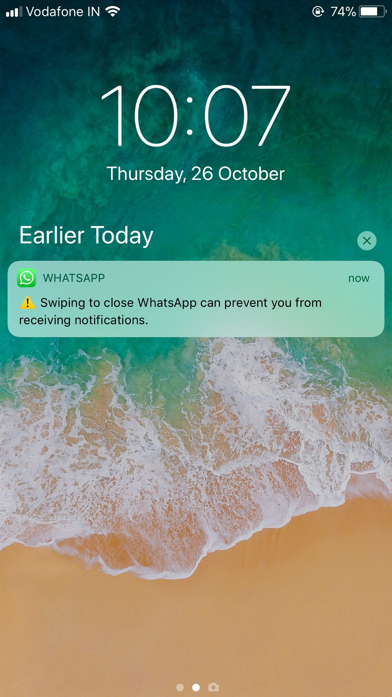

# PruebaNotificaciones
Prueba de notificaciones en background

Aplicación de prueba para probar notificaciones en background y ejecutar una serie de recordatorios via notificación local periodicos en un intervalo dado. Para la aplicación de ejemplo al recibir una notificación se emiten 5 notificaciones en un intervalo de 5 segundos entre cada notificación.

Al iniciar la aplicación en background y recibir una notificación push con la bandera content-avaliable la aplicación es capaz de ejecutar código durante 30 segundos hasta que el tiempo de background llegue a 0. Cuando el tiempo ha expirado la aplicación vuelve a despertar en modo background por 30 segundos más.

Para el funcionamiento se realizaron pruebas con la aplicación Easy APNs Provider para realizar la implementación quizá sea necesario ver la documentación de apple sobre el cuerpo de los mensajes a enviar [(ver documentación de apple)](https://developer.apple.com/documentation/usernotifications/setting_up_a_remote_notification_server/pushing_background_updates_to_your_app). En la siguiente imagen se muestran los parámetros de la notificación en la aplicación Easy APNs Provider y la depuración en consola:

<!--
    Esta es otra manera de añadir una imagen, utilizamos html para centrar la imagen en el contenedor
  
-->

  

De mismo modo, en la siguiente imágen se ejemplifica el funcionamiento de la notificación inicial y las siguientes notificaciones programadas:

  

Con respecto a la aplicación es necesario añadir las capabilities de background modes: Background fetch y Remote notifications, como se muestra en la siguiente imagen:

  

En el dispositivo es necesario verificar que la actualización en 2o. plano está activada para la aplicación, como se muestra en las siguientes imagenes:

  
  

# Consideraciones especiales

Desde la versión 11 de iOS las notificaciones tienen caracterísitcas importantes [(ver documentación apple)](https://developer.apple.com/documentation/uikit/uiapplicationdelegate/1623013-application) y por tanto la aplicación sólo recibe notificaciones en background si la aplicación no ha sido cerrada forzosamente por el usuario (desde el springboard), es decir, las notificaciones sólo llegarán si el usuario abrió la aplicación y no hice force-quit o si el dispositivo ha sido reiniciado.

Se anexa un ejemplo de la mitigación realizada por otras aplicaciones manteniendo la implementación de notificacion estándar.

  

